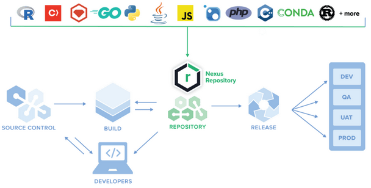

# Artifact manager 

## Motivation

When committing and pushing changes regularly by a large development team, Jenkins can execute hundreds of build jobs every day. 
Every build can potentially download (or create) hundreds of python packages, docker base images, AI model binaries, configuration files, executable binaries etc..

We call these files **artifacts**, or binaries. Artifact is a file, which is downloaded or created as part of the CI/CD pipeline. 


We can divide artifacts into two groups - artifacts that you create (e.g. docker image you built), or artifacts that your application relies on, but you haven't developed them yourself (e.g. python package you're installing from PyPI or docker base image provided by a DockerHub).

There are several problems that arise with artifacts:

- How can we make sure a vulnerability is not propagated to our production system? 
- Large artifacts (like Docker base image) can significantly slowing down the build time. 
- By using artifact that is protected by restricted license, your team can innocently violate software licensing.

# Nexus Repository Manager

[Nexus Artifact Manager](https://www.sonatype.com/products/sonatype-nexus-repository) is used to store and manage your artifacts. Here are its key features:

- Can store various types of artifacts, including Maven, PyPi packages, Docker images, Helm charts, and more.
- Acts as a proxy for remote repositories, fetching and caching artifacts from external sources like PyPI (see figure below). This helps improve build speed by reducing the need to download artifacts repeatedly.
- Single source of truth for all environments, including developer's local machine. This ensures that the correct versions of dependencies are used, leading to more reliable builds and deployments.
- Nexus can manage the lifecycle of artifacts, including promote and release versions of your artifacts.
- Nexus provides reporting and monitoring tools to track artifact usage, repository health, vulnerabilities and software licensing violation.



## Installation

We will deploy the Nexus server using a [pre-built Docker image](https://hub.docker.com/r/sonatype/nexus3/).

Throughout this tutorial we will be experimenting with the Nexus server while running locally:

```shell
sudo mkdir /nexus-data && sudo chown 200:200 /nexus-data && sudo chmod 700 /nexus-data
docker run -d -p 8081:8081 --name nexus -v /nexus-data:/nexus-data -e INSTALL4J_ADD_VM_PARAMS="-Xms400m -Xmx400m -XX:MaxDirectMemorySize=400m" sonatype/nexus3
```

## Repository Management

Nexus ships with a great [Official docs](https://help.sonatype.com/repomanager3/nexus-repository-administration/repository-management) and compatible with [many package managers](https://help.sonatype.com/repomanager3/nexus-repository-administration/formats): Java/Maven, npm, NuGet, PyPI, Docker, Helm, Yum, and APT.

### Repository Types

#### Proxy repo

Proxy repository is a repository that is linked to a remote repository. Any request for a component is verified against the local content of the proxy repository. If no local component is found, the request is forwarded to the remote repository.

#### Hosted repo

Hosted repository is a repository that stores components in the repository manager as the authoritative location for these components.

#### Group repo

Repository group allow you to combine multiple repositories and other repository groups in a single repository.
This in turn means that your users can rely on a single URL for their configuration needs, while the administrators can add more repositories and therefore components to the repository group.


## Create a PyPi proxy repo

1. After signing in to your Nexus server as an administrator, click on the **Server configuration** icon.
2. Create a [PyPi proxy repo](https://help.sonatype.com/repomanager3/nexus-repository-administration/formats/pypi-repositories), call it `pypi.org-proxy`, as it proxies the official https://pypi.org packages index.
3. On your machine, in some local Python venv, [configure](https://help.sonatype.com/repomanager3/nexus-repository-administration/formats/pypi-repositories#PyPIRepositories-Download,searchandinstallpackagesusingpip) `pip` to download packages from your private artifact repository. To do so, create a file `pip.conf` with the following content:
```text
[global]
trusted-host = localhost:8081
index-url = http://localhost:8081/repository/test/simple
```

4. Put the `pip.conf` file either in your virtual env folder (`venv`). Alternatively (when installing packages outside a virtual env, e.g. in a Jenkins agent), define a custom location by setting the following env var: `PIP_CONFIG_FILE=<path-to-pip-conf>`. Note that there are many [other methods](https://pip.pypa.io/en/stable/topics/configuration/#location).
5. Install `flask`. Make sure you see the package when browsing the repo content. 

## Repository Health Check

[Repository Health Check (RHC)](https://help.sonatype.com/repomanager3/nexus-repository-administration/repository-management/repository-health-check) allows Nexus Repository users to identify open source security risks in proxy repositories at the earliest stages of their DevOps pipeline.

New vulnerabilities report is updated every 24 hours.

If you’re running Nexus Repository **Pro**, you can see a detailed report.

### Test it

1. Enable RHC by clicking the **Analyze** button on the relevant repository in **Repositories** page.
2. Try to install the [`insecure-package`](https://pypi.org/project/insecure-package/) pip package, this package contains built-in software vulnerability. Watch how Nexus recognizes the vulnerability.


## Create a PyPi hosted repo, pack and upload a Python library

### An overview of packaging for Python

Let's say you develop and maintain a Python package called `fantastic_auth` which responsible for authentication aspects in your application.
This package is aimed for internal use in different microservices. It is being used by other teams in your organization, which can install it by `pip install fantastic_auth` as part of their build process. 

Since this package should be used from within your organization only, there is no point store it in PyPI, which is the public Python Packages Index, but we would like to store and manage it in our private Nexus repo.  

1. Create two `pypi (hosted)` repos, call them `pypi-releases` and `pypi-snapshot`.  

   - **Releases** repo is intended to be the repository where your organization publishes **internal releases**.   
   - **Snapshots** repo is intended to be the repository where your organization publishes internal **development versions**, also known as snapshots.

Under `fantastic_auth`, you are given a sample source code for the library.
As you can see, in order to turn a directory with python files into a Python package, 
we need to add some necessary files and organize directory structure in a specific format.

The most important file is `setup.py` which exists at the root of your project directory.
This file configures some aspects of your project. Take a look at it.

Complete the below steps to build the package:

2. Install `build` library by `pip install build`, which is a simple build "frontend".
   [build](https://pypa-build.readthedocs.io/en/latest/) reads the `fantastic_auth/pyproject.toml` file and invokes the build "backend" as configured there ([setuptools](https://setuptools.pypa.io/en/latest/index.html) in our case).

3. Open a terminal in the library root directory, build the package by: `python -m build`.    
   This will build the package in an isolated environment, generating two formats under the `dist/` dir: a source-distribution (`.tar.gz`), and wheel (`.whl`).

   - **Source-distribution** (or `sdist` for short) is a format that contains the source code in pure Python files, along with setup and build scripts.
     When installed, these packages are **built and compiled** on the target system.
   
   - **Wheel** (of `whl` for short) is a binary distribution format that contains **pre-compiled**, platform-specific versions of a Python package.
     whl packages are typically faster to install because they don't require compilation on the target system. 
   
   `pip` always prefers wheels.

4. Finally, it's time to upload your package to Nexus. We will use [twine](https://twine.readthedocs.io/en/latest/) to upload the package. Install Twine by: `pip install twine`.
5. In order to upload your package to the PyPI repo in Nexus, configure the `fantastic_auth/.pypirc` file [as describe in Nexus docs](https://help.sonatype.com/repomanager3/nexus-repository-administration/formats/pypi-repositories#PyPIRepositories-Uploadtoahostedrepositoryusingtwine).
6. Run Twine to upload all archives under `dist/` by:
   ```bash
   python3 -m twine upload --config-file .pypirc --repository pypi-releases -u <nexus-username> -p <nexus-password> dist/*
   ```
7. Observe the uploaded packages in Nexus server.

## Create group repo

1. Create a **PyPI group repo**, which contains both the proxy and hosted repo you've created in the previous sections. 

Note that the order of the repositories listed in **Ordered Group Repositories** is important. When the repository manager searches for a component in a group, it will return the first match. 
It's recommended placing hosted repositories higher in the list than proxy repositories within the list. 

2. Change the repo URL in `pip.conf` according to the new group repo URL.
3. Make sure you are able to install new packages after changing the repo URL.


# Exercises 

## :pencil2: Store YAML artifacts in Nexus

In this exercise we assume a Jenkins pipeline that generates a YAML artifact (for Kubernetes Deployment manifest) and store the artifact in Nexus `raw` hosted repo. 

1. Under `yaml_artifact_example` you'll find:
   2. `my-deployment.yaml` - this is a **template** YAML manifest (note that `{{ img_tag }}` is a placeholder for a variable that should be replaced with an actual image tag).
   3. `generate_yaml.py` - is a Python code that replaces the `{{ img_tag }}` with an actual image tag provided as an argument to the script (e.g. `python generate_yaml.py 0.0.1`).

   Test it by `python generate_yaml.py 0.0.1` and inspect the generated YAML artifact.
2. Create a bash script that generates the YAML artifact and push it to a **hosted raw** repo called `k8s-manifests`. 
3. (Optional) Create a Jenkins pipeline that generates the artifacts, and integrate your script as a Stage.

## :pencil2: Define s3 as an artifacts storage

Follow:  

https://help.sonatype.com/repomanager3/nexus-repository-administration/repository-management/configuring-blob-stores#ConfiguringBlobStores-AWSSimpleStorageService(S3)


## :pencil2: Nexus Docker repo  

1. In your Nexus server, create `Docker(proxy)`, `Docker(hosted)` and `Docker(group)` which contains the two repos (the proxy and hosted).
2. From your local machine, pull an image from the created group repo.
4. From your local machine, push an image into the hosted repo.

## :pencil2: Policy to clean-up artifacts 

If you are not cleaning out old and unused components, your repositories will grow quickly. Over time, this will present risks to your deployment:

- Storage costs will increase
- Performance is impacted
- Artifact discovery will take longer
- Consuming all available storage will results in server failure

Create two clean-up policies as follows:

- `dev-cleanup` policy that cleans artifacts after 30 days.
- `prod-cleanup` policy that cleans artifact after 1 year (production artifacts should be stored for long time). 

Create associate the `dev-cleanup` policy with one of your repositories.

## :pencil2: Serve Nexus over HTTPS (using self-signed certificate)

Please follow:   

https://help.sonatype.com/repomanager3/nexus-repository-administration/configuring-ssl#ConfiguringSSL-ServingSSLDirectly

At the end, you should be able to communicate with the server by `https://localhost:8443`.
