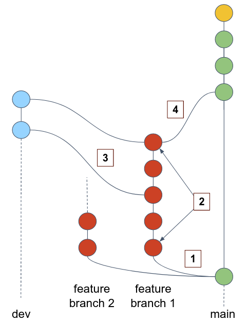

# Pull Request testing

## Motivation

Let's review the following Git workflow:



1. Developers branching our from an up-to-date `main` branch into their feature branch. 
2. They commit changes into their feature branch.
3. At some point, they want to test their changes in Development environment. They merge the feature branch into `dev` branch, and push to remote.
4. After the changes have been tested in development environment and a few more fixes has been committed, the developer creates a Pull Request from their feature branch into `main`.
5. The `main` branch can be deployed to production environment directly after the merge. 

From the above Git workflow, we can conclude that a Pull Request is a crucial point for testing and review code changes before they are merged into the `main` branch, and potentially deployed to production systems. 
Thus, it's common practice to let Jenkins perform an extensive testing on an opened Pull Requests.

So far we've seen how pipeline can be built and run around a single Git branch (e.g. `main` or `dev`). 
Now we would like to create a new pipeline which will be triggered on **every PR** that is created in GitHub.
For that we will utilize Jenkins [multi-branch pipeline](https://www.jenkins.io/doc/book/pipeline/multibranch/).

## Create a multi-branch pipeline

1. In `main` branch, create the `pr-testing.Jenkinsfile` as follows:
```text
pipeline {
    agent any

    stages {
        stage('Unittest') {
            steps {
                echo "testing"
            }
        }
        stage('Lint') {
            steps {
                echo "linting"
            }
        }
        stage('Functional test') {
            steps {
                echo "testing"
            }
        }
    }
}
```
2. Commit the Jenkinsfile and push it.
3. From the Jenkins dashboard page, choose **New Item**, and create a **Multibranch Pipeline** named `pr-testing`.
4. Under **Branch Sources** choose **GitHub**
5. In the **GitHub** source section, under **Behaviors**, delete all behaviors other than **Discover pull requests from origin**. Configure this behavior to **Merging the pull request with the target branch revision**.


### Test the pipeline

6. From branch `main` create a new branch called `sample_feature` and change some code lines. Push the branch to remote.
7. In your app GitHub page, create a Pull Request from `sample_feature` into `main`.
8. Watch the triggered pipeline in Jenkins. 


## Protect `main` branch 

We also would like to protect the `main` branch from being merged by non-tested branch.

1. From GitHub main repo page, go to **Settings**, then **Branches**.
2. **Add branch protection rule** for the `main` branch as follows:
   1. Check **Require a pull request before merging**.
   2. Check **Require status checks to pass before merging** and search the `continuous-integration/jenkins/pr-merge` check done by Jenkins.
   3. Save the protection rule.

Your `main` branch is now protected and no code can be merged to it unless the PR is reviewed by other team member and passed all automatic tests done by Jenkins.

## Pull requests tests

Automated testing is a very broad topic. In this section we will lightly cover 3 types of testing: **unittests**, **code linting**, **functional testing**. But the are many more...

### Unittests (in Python)

Unit testing is a software testing technique where individual components of code are tested in isolation to ensure they behave as expected, helping to identify and fix bugs before the code is built.

In Python, `unittest` is a testing framework that allows developers to write and run unit tests.

1. In the `roberta` directory, you are given directory called `tests`. This is a common name for the directory containing all unittests files. The directory contains a file called `test_cache.py` which implements unittest for the caching functionality of the app (the server caches the recent requested texts and their results). 

2. Run the unittest locally, check that all tests are passed:

```shell
cd roberta
python3 -m pytest --junitxml results.xml tests
```

**Note**: Usually the `unittest` package is used to execute unit tests in Python, but here we used the `pytest` package (has to be installed by `pip install pytest`). We did it because `pytest` allows to export the test results in a `.xml` file format that can be presented by Jenkins in a human friendly format.

3. Integrate the unittesting in the `pr-testing.Jenkinsfile` under the **Unittest** stage.

4. You can add the following `post` step to display the tests results in the readable form:

```text
post {
    always {
        junit allowEmptyResults: true, testResults: 'results.xml'
    }
}
```

5. Try to intentionally make the test fail, and make sure Jenkins is blocking the PR to be merged when the unittest stage fails!

### Code linting check (in Python)

[Pylint](https://pylint.pycqa.org/en/latest/) is a [static code analyser](https://en.wikipedia.org/wiki/Static_program_analysis) for Python.
Pylint analyzes your code without actually running it. It checks for syntax errors, enforces a coding standard, and can make suggestions about how the code could be refactored.

1. Install `pylint` using `pip`.
2. In the root directory of your repo, generate a default template for `.pylintrc` file which is a configuration file used to customize and enforce coding standards, styles, and static analysis checks.

```shell
pylint --generate-rcfile > .pylintrc
```

3. Lint your code locally by:

```shell
python3 -m pylint *.py
```

How many warnings do you get? If you need to ignore some unuseful warning, add it to `disable` list in the `[MESSAGES CONTROL]` section in your `.pylintrc` file.

4. Integrate the linting check in `pr-testing.Jenkinsfile` under the **Lint** stage.
5. Add Pylint reports to Jenkins pipeline dashboard:
   1. Install the [Warnings Next Generation Plugin](https://www.jenkins.io/doc/pipeline/steps/warnings-ng/).
   2. Change your linting stage to be something like (make sure you understand this change):
   ```text
   steps {
     sh 'python3 -m pylint -f parseable --reports=no *.py > pylint.log'
   }
   post {
     always {
       sh 'cat pylint.log'
       recordIssues (
         enabledForFailure: true,
         aggregatingResults: true,
         tools: [pyLint(name: 'Pylint', pattern: '**/pylint.log')]
       )
     }
   }
   ```


### Functional testing

Functional testing evaluates whether the app works as intended. 
It involves testing the application against some pre-defined scenario (usually the common scenario of your customers), and ensure that the software meets its functional objectives.

Implement functional testing in the `pr-testing.Jenkinsfile` under the **Functional test** stage. 

- Build a docker container for the app.
- Run the container in the background, while publishing the correct ports.
- Analyze simple sentences with clear sentiments:

```shell
# Sentence: Intel is happy and excited to launch the new generation of processors
# Expect positive labels: optimism, excitement
curl localhost:8081/analyze?text=Intel%20is%20happy%20and%20excited%20to%20launch%20the%20new%20generation%20of%20processors

# Sentence: This is terrible movie
# Expect negative labels: disappointment, disgust, fear
curl localhost:8081/analyze?text=This%20is%20terrible%20movie.

# Sentence: This is terrible movie
# Expect neutral labels: neutral
curl localhost:8081/analyze?text=This%20is%20a%20neutral%20statement
```

- Compare the results to the expected sentiments.
- Stop and remove the container from disk.

**Note**: In general, running services within the Jenkins agent, as we did in the above testing, is not a good idea. It's better to deploy the application under test (AUT) in test environments. 

# Exercises

### :pencil2: Run tests in parallel 

Use [`parallel`](https://www.jenkins.io/doc/book/pipeline/syntax/#parallel) directive to run the test stages in parallel, while failing the whole build when one of the stages is failed.

### :pencil2: Implement Python dependency vulnerability testing

While Snyk scans vulnerabilities in the container OS level, it's also necessary to scan your Python code and the dependencies you use. 

Integrate [safety](https://pyup.io/safety/) and [bandit](https://bandit.readthedocs.io/en/latest/) into the `pr-testing.Jenkinsfile` pipeline. 

