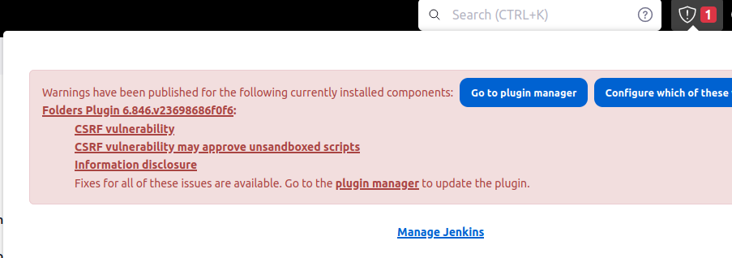

# CI/CD with Jenkins

You can choose to install Jenkins either using AWS, on an EC2 instance (recommended), or on your local machine. 

## Method 1: Install Jenkins Server on EC2

Jenkins is typically run as a standalone application in its own process with the built-in Java servlet container/application.

1. Create a ***.medium, Ubuntu** EC2 instance with `30GB` disk.
2. Connect to your instance, install java by

```bash
sudo apt update
sudo apt install openjdk-11-jre
```

3. Download and install Jenkins as described [here](https://www.jenkins.io/doc/book/installing/linux/#debianubuntu).
4. On Jenkins machine, [install Docker engine](https://docs.docker.com/engine/install/ubuntu/). You may want to add jenkins linux user the docker group, so Jenkins could run docker commands:
   ```shell
   sudo usermod -a -G docker jenkins
   sudo usermod -a -G docker $USER
   ```
5. Install [`kubectl`](https://kubernetes.io/docs/tasks/tools/install-kubectl-linux/). 
6. Install Git if needed.
7. You'll need your Jenkins server to have static public ip address. From the EC2 navigation pane, create an **Elastic IP** and associate it to your Jenkins instance.
8. Open port `8080` in your instance's security group, and visit your Jenkins server via `http://<static-ip>:8080` and complete the setup steps.

## Method 2: Install Jenkins locally

Follow the [official installation guide](https://www.jenkins.io/doc/book/installing/linux/) and choose the relevant OS installation. 


## Configure a GitHub webhook

**Note**: Throughout this module you will build, test and deploy an app called Roberta (can be found in our shared repo under `roberta`).
This is a simple flask webserver that serves a [sentiment analysis](https://en.wikipedia.org/wiki/Sentiment_analysis) AI model based on [roberta-base](https://huggingface.co/roberta-base).
The model was trained on a data from Reddit to analyze the sentiment of an English sentence. 

A **GitHub webhook** is a mechanism that allows GitHub to notify a Jenkins server when changes occur in the repo. 
When a webhook is configured, GitHub will send a HTTP POST request to a specified URL whenever a specified event, such as a push to the repository, occurs.

1. If you don't have it yet, create a new GitHub repository and copy the files under the `roberta` directory to the root directory of your repo, push it.
2. To set up a webhook from GitHub to the Jenkins server, on your GitHub repository page, go to **Settings**. From there, click **Webhooks**, then **Add webhook**.
3. In the **Payload URL** field, type `http://<jenkins-ip>:8080/github-webhook/` (if you run the Jenkins server locally, please read the note below). In the **Content type** select: `application/json` and leave the **Secret** field empty.
4. Choose the following events to be sent in the webhook:
    1. Pushes
    2. Pull requests

#### Note for students running their Jenkins server locally

As your Jenkins server is being running locally, it is not accessible over the internet. 
This creates a communication challenge between GitHub and your Jenkins server, since GitHub has to notify Jenkins when events occur in the repo.

[Ngrok](https://ngrok.com/) can solve this problem by creating a secure tunnel between the local machine (where the Jenkins is running) and a public URL provided by Ngrok.
It exposes the local server to the internet, allowing GitHub servers to reach the webhook URL and send updates to Jenkins.

Sign-up for the Ngrok service (or any another tunneling service to your choice), then install the `ngrok` agent as [described here](https://ngrok.com/docs/getting-started/#step-2-install-the-ngrok-agent). 

Authenticate your ngrok agent. You only have to do this once:

```bash
ngrok config add-authtoken <your-authtoken>
```

Since the Jenkins service is listening on port `8080`, start ngrok by running the following command:

```bash
ngrok http 8080
```

Your Jenkins public URL is the URL specified in the `Forwarding` line (e.g. `https://16ae-2a06-c701-4501-3a00-ecce-30e9-3e61-3069.ngrok-free.app`).

## Managing Jenkins

Most standard administrative tasks can be performed from the screens in the **Manage Jenkins** section of the dashboard.

Let's take a look on some of them:

- **System**: Configure global settings and paths for the Jenkins instance.
- **Plugins**: Add, update, remove, disable/enable plugins that extend the functionality of Jenkins. 
- **Nodes and Clouds**: Add, remove, control, and monitor the nodes used for the agents on which build jobs run.
- **Manage Credentials**: Configure the credentials that provide secure access to third-party sites and applications that interact with Jenkins.
- **Users**: Manage users defined in the Jenkins user database. This is not used if you use a different security realm such as LDAP or AD.
- **System Information**: Displays information about the Jenkins environment.
- **System Log**: Jenkins log that contains all java.util.logging output related to Jenkins.

More information can be found [here](https://www.jenkins.io/doc/book/managing/).

## Update plugins 

Jenkins plugin updates are essential for maintaining compatibility, security, and functionality, as they ensure that the latest features and bug fixes are incorporated into the Jenkins ecosystem.

As your Jenkins server will be used not only during this module, but actually up to the end of course, 
you are expected to maintenance your server (as if it is functioning for a real project). Update your plugins when needed. 

The below screenshot (taken from the top right bar in the main Jenkins dashboard) warns the user regarding available plugin update.



You can also see and perform updates in **Manage Jenkins** > **Manage Plugins**.

## The `jenkins` user and its home directory

When installed Jenkins, a `jenkins` linux user was created during the installation process and is used to execute Jenkins processes and manage its files.
Jenkins stores its global configuration in files on the `jenkins` home directory. On Ubuntu by default, this is set to `/var/lib/jenkins`. 

Jenkins uses this directory to store configurations, to perform builds and keep archives. 

# Self-check questions

[Enter the interactive self-check page](https://alonitac.github.io/UPES-CSDV-3001/multichoice-questions/jenkins_setup.html)

# Exercises 

### :pencil2: Install Jenkins plugins

The Jenkins community plugins are extensions that enhance the functionality of the Jenkins automation server. 

In the **Dashboard** page, choose **Manage Jenkins**, then **Manage Plugins**. In the **Available** tab, search and install:

- **Blue Ocean**
- **Docker Pipeline**
- **Configuration as Code**

Then restart jenkins by `http://<ip>:8080/safeRestart`

### :pencil2: Custom log recorder

Create [log recorder](https://www.jenkins.io/doc/book/system-administration/viewing-logs/#logs-in-jenkins) that track only INFO logs related to **GitHub webhook**. 

### :pencil2: Run Jenkins using Docker

Launch the Jenkins server in a docker container.

You may utilize the Jenkins [docker official docs](https://www.jenkins.io/doc/book/installing/docker/)

### :pencil2: Configure a GitHub webhook with token 

1. In Jenkins, create a text credentials.
2. In **Manage Jenkins**, **Configure System**, configure the **GitHub server** to use the created credentials.
3. Configure the token in GitHub webhook page. 