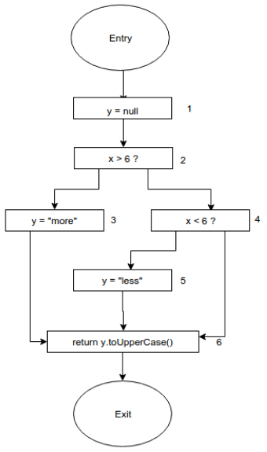
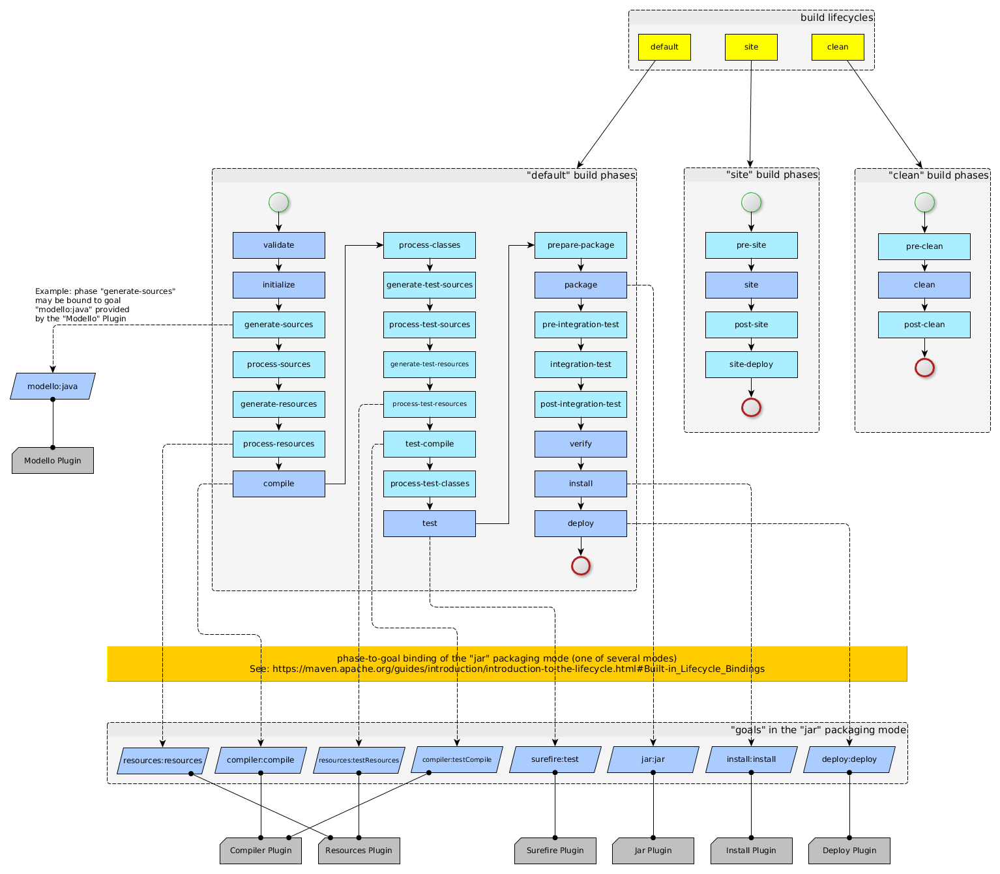
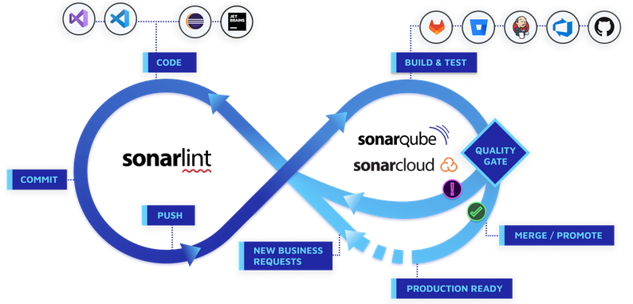

# Static code analysis with SonarQube

## What is static code analysis?

The goal of **static analysis** is to reason about program behavior without running the code. 
In contrast, the goal of **dynamic analysis**, is to reason about program behavior at run-time.

There are 3 main motivations for static analysis:

- Optimize the program (e.g. replace `x[i-1]` with `x[2]` if we know that `i` is always 3).
- Find code bugs (e.g. there is a scenario where the call `y.toUpperCase()` is done when `y` is a `null` pointer, instead of a valid string value).
- Find potential security vulnerabilities (e.g. can a POST request personal data flow in the server to SQL server without being sanitized?)

**Data flow analysis (DFA)** is a set of static analysis techniques aimed to analyze the flow of data in the program, and collect information about the way the variables are defined and used in the program.

Here is a simple Java example: 

```java
public String badCode(int x) {
    String y = null;
    if (x > 6) {
        y = "more";
    } else if (x < -6) {
        y = "less";
    }
    return y.toUpperCase();
}
```

Let's analyze the function behaviour for different values of `x`.
When the input value `x` is between -6 and 6 (inclusive), both conditions in the `if` and `else if` statements are `false`. 
In this case, the variable `y` remains `null`, and calling `toUpperCase()` on a `null` reference will lead to a `NullPointerException`.

The above example belongs to an analysis problem class called **null pointer analysis**.

What we've done right now, is data a flow analysis. 
But how can we formulate the null pointer analysis problem such that a computer program would detect null pointers? Keep reading...

Data Flow Analysis typically operates over a **Control-Flow Graph (CFG)**, a graphical representation of a program.

The Control Flow [Graph](https://en.wikipedia.org/wiki/Graph_(discrete_mathematics)) (CFG) is a representation of all paths that might be traversed through a program during its execution. 
It's a directed graph where:

- Each node represents a statement
- Edges represent control flow

Here is an example of a CFG for the above Java function:



We know that program point 1 assigns `null` to a variable, and we also know this value is overwritten at points 3 and 5. 
Using this information, we can search for a valid path from point 1 to 6 that is not visiting points 3 or 5. 
If we find such path, we can determine that the program have a possible null-pointer exception.

The same way as we detected the problem just by reviewing the code statically, there is an algorithm that fund such problem. 

Here are a few more common problem classes that DFA can solve:

- **Reaching definitions** - The reaching definition analysis calculates for each line, the set of definitions that may potentially cause the program reach this line. 
  For example:     

  ```text
  1 if b == 4:
  2  a = 5
  3 else: 
  4  a = 3
  5      
  6 if a < 4:
  7   ...
  ```    
  The reaching definition of variable `a` at line 7 is the set of assignments `a = 5` at line 2 and `a = 3` at line 4. 

- **Liveness analysis** - At each point of the program, calculate the variables that are "live" (variables that hold value that may be needed in the future).
- **Definite assignment analysis** - Ensures that a variable is always assigned before it is used.

There are many more analysis problem classes and algorithms that solve similar problems. They would **not** be covered in this tutorial 🎉. 
The internet is full of formal and informal content about Data Flow Analysis.

#### Solve data flow problem using Iterative Algorithms

A solution to a class of a data flow problem is to find all possible paths and variable assignments for each node of the given CFG.
This ideal solution is called the **meet over all paths (MOP)** solution, and is usually not always possible computationally. 

We must sometimes settle for a solution that provides less precise information.
For that, many different algorithms have been designed for solving a dataflow problems, the most common ones can be classified as [iterative algorithms](https://en.wikipedia.org/wiki/Data-flow_analysis#An_iterative_algorithm).

## Tainted analysis

Programs manipulate data. Some data should not leave the program (e.g. a variable contains the password for the database),
other data should not be used or reach some sensitive parts of the program (you'll see an example soon).

- If the attacker can read sensitive information from the program, we say that the program has an **information disclosure vulnerability**.
- If the user can send harmful information to the program, we say that the program has a **tainted flow vulnerability**.

**Tainted analysis** is a security analysis technique that traces and identifies potentially untrusted or "tainted" data inputs within a program to prevent vulnerabilities.
Tainted analysis has both dynamic and static approaches.

### Example: SQL Injection 

A [SQL injection](https://owasp.org/www-community/attacks/SQL_Injection) attack consists of insertion or "injection" of a SQL query via the input data from the client to the application.
A successful SQL injection exploit can read sensitive data from the database, modify database data (Insert/Update/Delete), and more.

Let's see it in action. 

1. Launch the Flask webserver in `sql_injection`. 
2. Visit the server and register some users into the system.
3. Login to one of the users. 
4. Now logout and login using this username and password: `aaa' OR '1=1`.
5. As can be seen, you've fetch **all** users from the database, instead of being rejected by a bad username and password. Try to debug the SQL query in the `get_user()` function to understand the injection vulnerability mechanism.

To avoid SQL injection flaws is simple. The user input should be sanitized before used in the SQL query. 
This can be done by either: a) stop writing dynamic queries with string concatenation; and/or b) prevent user supplied input which contains malicious SQL from affecting the logic of the executed query.

The `get_user()` function contains a secure version of the query (commented out).


#### Terminology 

- **Source**: Point in the program where external input is received.
- **Sink**: Point in the program where data from a source is used in a way that could lead to security vulnerabilities.
- **Sanitizer**: Mechanism or code responsible for ensuring that the data is safe and doesn't pose security risks before reaching a sink.


## Maven

[Apache Maven](https://maven.apache.org/index.html) is a powerful and widely used build automation and project management tool.
It simplifies the process of managing and building **Java-based** projects by providing a standard structure and a set of conventions.

### Installation

**Note**: You must have Java installed in order to proceed (If you've set up a Jenkins server, Java is already installed).

1. Download the latest version of Maven from here:   

https://maven.apache.org/download.cgi

2. Extract the compressed directory, copy directory content into `/mvn` (or any other location to your choice), and permanently add `/mvn/bin` into your `PATH`:

```bash
# change according to your maven version
sudo cp -r apache-maven-3.9.5/ /mvn

echo 'export PATH=$PATH:/mvn/bin' >> .bashrc
```

3. Make sure Maven is available:

```console
$ mvn -v
Apache Maven 3.9.5 (57804ffe001d7215b5e7bcb531cf83df38f93546)
Maven home: /mvn
Java version: 11.0.20.1, vendor: Ubuntu, runtime: /usr/lib/jvm/java-11-openjdk-amd64
Default locale: en, platform encoding: UTF-8
OS name: "linux", version: "5.19.0-1025-aws", arch: "amd64", family: "unix"
```

### Maven build lifecycle and phases

Consider some Java project (basically, a collection of `.java` files). In order to deploy the project to some environment, there are some **phases** that the source code should pass through.
First, we should validate that all the information is available (e.g. make sure all the dependencies are listed somewhere), then to compile the code, run some tests on the compiled version (e.g. unittests), 
then to pack it into a single artifact with all dependencies... etc... etc..

Similarly, Maven is based around this concept, which called - [build lifecycle](https://maven.apache.org/guides/introduction/introduction-to-the-lifecycle.html) - a well defined process for building and distributing a project.

There are three built-in build lifecycles: `default`, `clean` and `site`.
The `default` lifecycle handles your project deployment (build, test, deploy...), the `clean` lifecycle just remove all files generated by the previous build, while the `site` lifecycle creates kind of a documentation website for your project.

We will focus on the `deafult` lifecycle. 

The `default` lifecycle comprises of the following phases:

- `validate` - validate the project is correct and all necessary information is available.
- `compile` - compile the source code of the project.
- `test` - test the compiled source code using a suitable unit testing framework. These tests should not require the code be packaged or deployed.
- `package` - take the compiled code and package it in its distributable format, such as a `.jar`, `.war`, etc...
- `verify` - run any checks on results of integration tests to ensure quality criteria are met.
- `install` - install the package into the local repository, for use as a dependency in other projects locally.
- `deploy` - done in the build environment, copies the final package to the remote repository for sharing with other developers and projects.

These lifecycle phases (plus the other lifecycle phases not shown here) are executed sequentially to complete the `default` lifecycle.

For example, if you want to pack your project into a single executable file (e.g. `.jar`), run the `mvn package` command, which internally completes the `validate`, `compile`, `test`, then `package` phases - all the phases coming before the `package` phase.

In order to achieve each phase, Maven uses small tasks called **plugin-goals** (the syntax is `PLUGIN:GOAL`, **goal** represents a capability of that **plugin**).
A plugin goal represents a specific task which contributes to the completion of some phase.

For example, the [Surefire Plugin](https://maven.apache.org/surefire/maven-surefire-plugin/) is used during the `test` phase of the build lifecycle to execute the unittests of an application.
The plugin has only one goal - `surefire:test`. 

To only run the unit tests of an application: 

```bash
mvn surefire:test
```

Or you can run phases together with specific plugins:

```bash
mvn clean compile surefire:test
```

If this were to be executed, the `clean` phase will be executed first, then the `validate` phase (and all its preceding build phases of the default lifecycle), finally the `surefire:test` plugin-goal would be executed.




### Create a sample project

In order to create the simplest of Maven projects, execute the following from the command line:

```bash
mvn archetype:generate -DgroupId=com.mycompany.app -DartifactId=my-app -DarchetypeArtifactId=maven-archetype-quickstart -DarchetypeVersion=1.4 -DinteractiveMode=false
```

An **archetype:generate** is a plugin goal that generates a template of a project, with some user inputs.

Under the created `my-app` directory you will notice the following standard project structure.

```text
my-app
|-- pom.xml
`-- src
    |-- main
    |   `-- java
    |       `-- com
    |           `-- mycompany
    |               `-- app
    |                   `-- App.java
    `-- test
        `-- java
            `-- com
                `-- mycompany
                    `-- app
                        `-- AppTest.java
```

The `src/main/java` directory contains the project source code, the `src/test/java` directory contains the test source, and the `pom.xml` file is the project's **Project Object Model (POM)**.

Maven uses a **Project Object Model (POM)** file to [define the project configuration](https://maven.apache.org/guides/introduction/introduction-to-the-pom.html).
It is a single configuration file that contains the majority of information required to build a project in just the way you want.
Some of the configuration that can be specified in the POM are the project dependencies, the plugin goals that can be executed, the build profiles, and so on. 
Other information such as the project version, description, developers, mailing lists and such can also be specified.

To pack the project into a single executable `.jar` file:

```bash
mvn package
```

To execute the created `.jar` file:

```console
$ java -cp target/my-app-1.0-SNAPSHOT.jar com.mycompany.app.App
Hello World!
```

## Developing with Sonar

SonarQube is a self-managed, automatic code review tool that systematically helps you deliver **Clean Code**. 

Clean Code is the standard for all code that results in secure, reliable, and maintainable software therefore, writing clean code is essential to maintaining a healthy codebase. 

Sonar provide a set of solutions for different stages of the development process:



SonarQube analyze your pull requests as part of the CI/CD workflows.
Sonar's **Quality gates** enforce a quality policy for your code before it's released to production.
You can also report the pull request analysis and quality gate status directly in GitHub.

## Running a SonarQube server

We'll use the [Community Edition Docker image](https://hub.docker.com/_/sonarqube/):

```bash
docker run -d --name sonarqube \
-e SONAR_SEARCH_JAVAOPTS="-Xmx256m -Xms128m -XX:MaxDirectMemorySize=256m -XX:+HeapDumpOnOutOfMemoryError" \
-e SONAR_CE_JAVAOPTS="-Xmx128m -Xms64m -XX:+HeapDumpOnOutOfMemoryError" \
-e SONAR_ES_BOOTSTRAP_CHECKS_DISABLE=true \
-v sonar-data:/opt/sonarqube/data -p 9000:9000 sonarqube:latest
```

Once your instance is up and running, Log in to http://localhost:9000 using System Administrator credentials:

- login: `admin`
- password: `admin`

## Analyzing a Maven project

You can perform a [SonarQube analysis for you Maven projects](https://docs.sonarsource.com/sonarqube/9.8/analyzing-source-code/scanners/sonarscanner-for-maven/).

In our shared repo, you'll find a Maven project under `java_sonar_example` with `pom.xml` file already configured with the `sonar` plugin and your running sonar server. 

Analysing your project can be done using a regular Maven goal `sonar:sonar` from the directory that holds the main project `pom.xml`.
You need to pass an [authentication token](https://docs.sonarsource.com/sonarqube/9.8/user-guide/user-account/generating-and-using-tokens/) using the `sonar.login` property in your command line.

```bash
mvn clean verify sonar:sonar -Dsonar.login=myAuthenticationToken
```

Scan the project and review the found issues in your Sonar server. 
